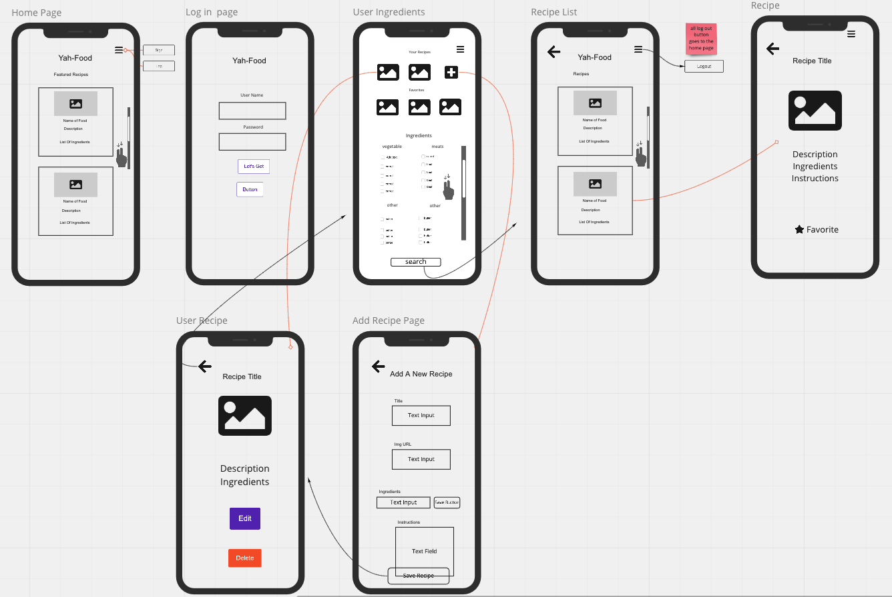

# Yah-Food

### Description

Yah-Food is a fun, simple, and creative app that helps the user discover
new foods based on the ingredients they already have. It offers a small
featured recipe section, ability to favorite certain recipes, and create
your own recipes. This App is suited for both mobile and desktop use.

### Team Members

Andrew Joy
Kevin Do
Minoka Kakizaki
Spencer Eagleton

#### Supabase Info

We have a 4 public tables, one called recipes that has an id(with a foreign key), title, images, description, and instructions columns. The second table is called the ingredients table which has an id(with a foreign key), ingredient column. The third table is our join table that takes the foreign key's from both the ingredients table and the recipe table as columns to link the two tables together in a many to many relationship. Our fourth table is called userRecipes which has an id, title, images, description, and instructions column. The userRecipes table has row-level-security and is where the data that the user able to input to create a row, update a row or delete a row.

[Miro Board](https://miro.com/welcomeonboard/eHFlaGxiZjZMNnRoT25kWDcwc1ExTFRJZ1FpeVlXVHhybWZlZjlmSHplOUVPdUhieGw4N1REc2c3OWFNd0oyWXwzMDc0NDU3MzY2NjAyNTcwMDUx?invite_link_id=417623334923)

### Planning

Mobile First Approach

#### App.js

- Routes:
  - "/" home page
  - ProtectedRoute that goes to /profile
  - /profile leads to /profile/new and /profile/edit
- useState of currentUser and setUser with default value of null
- useEffect of getUser();
- logOutUser() async await logout(), setCurrentUser(null)

#### Nav component

- Menu button that allows you to log out

#### Home Page (auth) - views

- setCurrentUser passed down as a prop from App.js
- useState of
  - type setType ('signin'), email setEmail (''), password setPassword (''), error setError ('')
  - featuredRecipe and setFeaturedRecipe
- handleSubmit async await signInUser and signUpUser

#### Home Page (auth) - components

1. Header and drop down menu
2. Map featured recipes displayed in a div recipe-card including the name, description, and list of ingredients
3. AuthForm (input for username and password, submit button/sign up button) with props passed down from views

#### /profile - views

- useState of
  - yourRecipes setYourRecipes, favorites setFavorites, ingredients setIngredients
- useEffect of getYourRecipes, getFavorites, and getIngredients
- handleSubmit which uses the function setIngredients for the search button ??
- handleAdd which leads you to /profile/add

#### /profile - components

- Map through your own recipes and your favorites
  - own recipes has add button next to it
- Ingredients checkboxes
- Search button

#### /profile/add - views

- useState of
  - title setTitle, imgage setImage, ingredients setIngredients, instructions setInstructions
- handleSubmit which uses the function addRecipe

#### /profile/edit - views

- useState of
  - title setTitle, imgage setImage, ingredients setIngredients, instructions setInstructions
- useEffect of fetchRecipeById
- handleSubmit which uses the function updateRecipe

#### /profile/add and /profile/edit (RecipeForm) - components

- Add form which takes in props from views
- Save recipe button

#### Services

- getUser(): client.auth.session()
- profile: getYourRecipes(), getFavorites(), getIngredients()
- add: addRecipe()
- edit: updateRecipe(), fetchRecipeById()
- logout()
